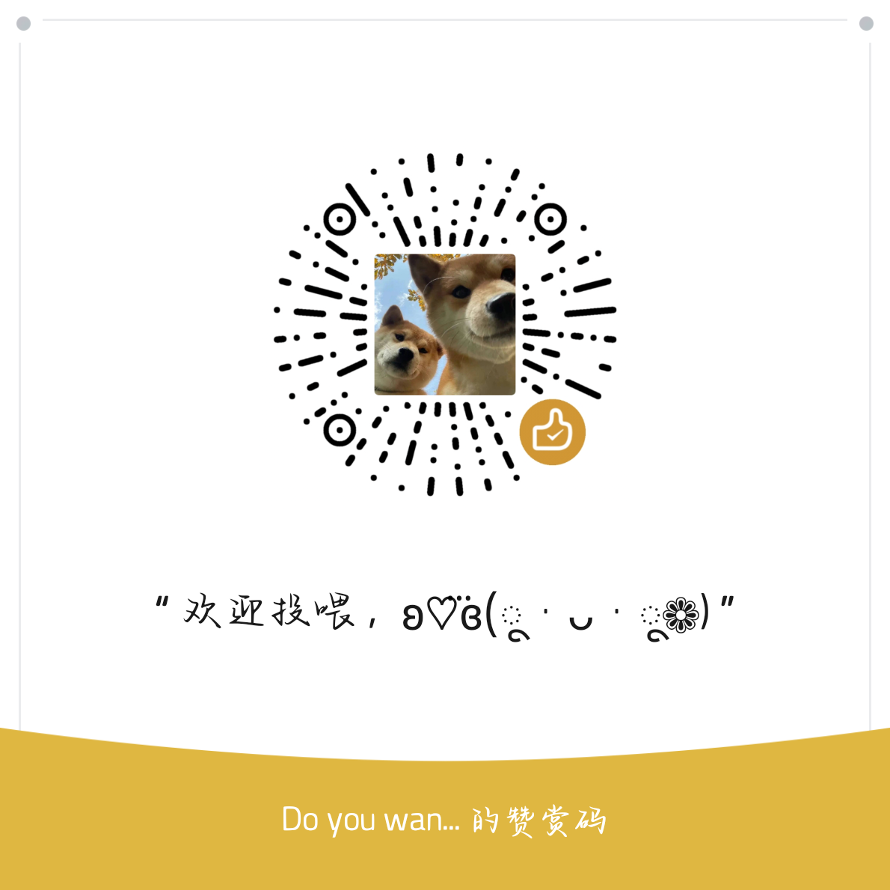

# FeatherCanvas Studio

FeatherCanvas Studio 是一个基于 Flutter 的 OpenAI-compatible 生图客户端。
目标很直接：让用户自己填写接口地址、密钥、模型和参数，
然后快速生成、预览和管理图片结果。

## 当前定位

- Base URL 配置
- API Key 配置（优先保存到系统安全存储）
- 模型列表获取、模型选择与尺寸参数
- 图片结果预览
- 图片编辑、Sprite Sheet 切片查看与目标帧替换
- GIF 合成
- 本地作品库、图片缓存与未引用文件清理

## 作品与切片保存策略

为了避免生成 Sprite Sheet 后自动产生大量切片文件，作品库遵循下面的保存规则：

- 文本生图结果可以自动保存到作品库，作为后续复用素材。
- 作品库条目保存生成参数快照，后续从作品卡片直接复用或复制参数。
- 帧动画生成完成后，只自动保存整张 Sprite Sheet，不自动落盘保存每个切片帧。
- Sprite Sheet 的切片预览只在内存中生成，用于播放、检查和编辑定位，不默认写入作品库。
- 用户手动保存当前帧时，才将该单帧作为 `spriteFrame` 写入作品库。
- 用户手动导出全部切片时，才批量保存所有切片；批量导出前应有明确确认，避免误产生大量文件。
- 编辑器替换帧或导出 Sprite Sheet 时，保存的是用户确认后的新结果。
- GIF 合成结果保存为独立作品，但不会反向拆分为多张帧图。
- 设置页提供未引用文件清理入口，会保留作品库仍在引用的生成文件。

## Sprite Sheet 编辑

图片编辑工作区用于把单帧图片插入或替换到已有 Sprite Sheet 中。

- 先选择 Sprite Sheet，再设置行数、列数和必要的切片校准。
- 目标帧可以在左侧直接输入帧号，或用上一帧、下一帧按钮调整。
- 也可以在右侧切片预览中直接点击 Sprite Sheet 格子或网格切片来选择目标帧。
- 单帧图片支持居中取景、背景透明处理、适配方式选择、复制上一帧和清空当前格。
- 插入或替换前会先展示原帧、单帧图片和替换后效果，确认后才写入新文件。
- 替换、复制或清空后会生成新的 Sprite Sheet，并把确认后的结果写入作品库。

## 接口与模型配置

- 默认不会再隐式使用 `gpt-image-2`。模型字段为空时，生成前会提示先获取模型列表或手动填写模型。
- 接口配置页支持从当前 Base URL 拉取 `/models` 列表，并自动优先选择图像模型候选。
- API Key 会迁移到 `flutter_secure_storage` 管理；旧版本保存在 SharedPreferences 中的密钥会在读取时迁移并清除明文副本。

## 文本生图数量

- 文本生图和默认设置页的生成数量使用手动数字输入，不再用固定的 1-4 张下拉限制用户。
- 客户端只做基础防误填保护，数量小于 `1` 时会自动回到 `1`；实际能否一次返回多张仍取决于接口服务商和模型能力。
- 作品库复用、预设、撤销重做和调试详情都会保留同一套数量参数，最终请求里的 `n` 会跟随用户输入。

## 计划支持

- OpenAI Images
- 兼容 OpenAI 格式的第三方服务

## 本地开发

```bash
flutter pub get
flutter run -d windows
```

## 应用图标

项目现在内置了自己的应用图标资源，并且已经接入 Android、Windows 可执行文件和
Windows 安装包。

- 图标源文件：`assets/branding/app_icon_source.png`
- Android 圆形图标源文件：`assets/branding/app_icon_round.png`
- Windows 打包图标：`windows/runner/resources/app_icon.ico`
- Android 启动图标：`android/app/src/main/res/mipmap-*/ic_launcher*.png`

如果后续需要重新生成所有平台图标，可以执行：

```bash
python tool/generate_app_icons.py
```

当前生成脚本依赖 Pillow。仓库里的 Windows runner 资源和 Inno Setup 安装包都复用
同一个 `app_icon.ico`，Android 则同时使用 `ic_launcher` 和 `ic_launcher_round`。

## 持续集成

项目使用 GitHub Actions 做提交校验和临时构建。

- `Flutter CI`：在 `main` 分支 push、面向 `main` 的 PR、手动触发时运行。
- 校验内容：`dart format`、`flutter analyze`、`flutter test`。
- 构建平台：当前仓库已启用的 Android 和 Windows。
- 临时产物：保留 7 天，文件名会带上 `pubspec.yaml` 中的版本号。
- 依赖缓存：复用 Flutter SDK、Pub cache、Gradle cache。
- 缓存清理：`Cleanup Actions Cache` 每周清理超过 7 天未访问的 Actions cache。

## 发布版本

正式发布使用 `Release` workflow。它由 `v*` tag 自动触发，构建完成后会把
Android APK、Windows 安装包和 Windows 便携包上传到 GitHub Release。

发布版本采用语义化版本号，写在 `pubspec.yaml` 中。例如：

```yaml
version: 0.2.2
```

GitHub Release 和 tag 使用同一个公开版本号，例如 `v0.2.2`，不追加
Flutter build metadata。

推送 `v0.2.2` tag 后会自动生成：

- GitHub Release：`FeatherCanvas Studio v0.2.2`
- Android 产物：`feather-canvas-studio-v0.2.2-android.apk`
- Windows 安装包：`feather-canvas-studio-v0.2.2-windows-setup.exe`
- Windows 便携包：`feather-canvas-studio-v0.2.2-windows-portable.zip`

Windows 不能只发布裸 `exe`。Flutter Windows 产物需要同时带上
`flutter_windows.dll`、`data/` 和插件 DLL 等运行文件，所以发布页会同时提供：

- `windows-setup.exe`：标准安装包，适合普通用户下载后安装。
- `windows-portable.zip`：便携版，解压整个目录后运行里面的应用程序。

当前仓库只启用了 Android 和 Windows 平台目录，所以 Release 只构建这两个平台。
后续如果需要发布 Web、Linux、macOS 或 iOS，需要先补齐对应 Flutter 平台目录，
再把对应平台加入 Release workflow。

发布前需要先完成这些步骤：

1. 修改 `pubspec.yaml` 中的 `version`。
2. 提交并推送到 `main`。
3. 创建并推送同名 tag，例如：

```bash
git tag -a v0.2.2 -m "FeatherCanvas Studio v0.2.2"
git push origin v0.2.2
```

如果 tag 已经存在但没有生成 Release，可以在 GitHub Actions 中手动运行
`Release` workflow，并输入现有 tag，例如 `v0.2.2`。

`Release` workflow 会检查 tag 是否和 `pubspec.yaml` 中的公开版本一致，并要求 tag
对应的提交已经在 `main` 分支上。tag 不应追加 Flutter build metadata。
它也会检查同名 Release 是否已经存在；
如果存在，会要求先提升版本号，避免覆盖已发布版本。

## 赞助

如果这个项目对你的工作有帮助，可以通过下列收款码支持持续维护。

<p align="center">
  
  
</p>
<p align="center">
  <sub>左：支付宝；右：微信赞赏。</sub>
</p>

## 开源许可

MIT
